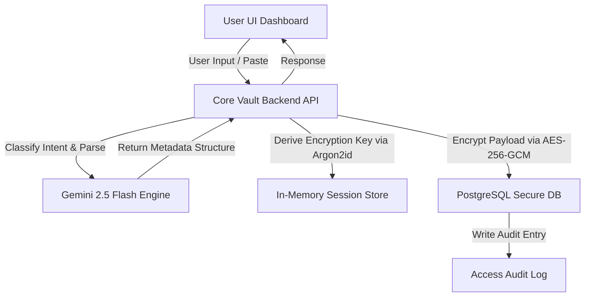

# 🧠 Core Vault (Secure Conversational AI Credential Store)

[](https://github.com/navigotechsolutions-labs/conversational-credential-vault/stargazers)
[](LICENSE)
[](https://www.typescriptlang.org/)
[](https://react.dev/)
[](https://nodejs.org/)
[](https://www.postgresql.org/)

An enterprise-grade, **zero-knowledge personal credential and knowledge vault** powered by Gemini 2.5 Flash. Core Vault features a conversational AI interface ("Vault Brain") that autonomously extracts, structures, and securely encrypts your credentials, API keys, documents, and code notes using AES-256-GCM.

It features a stunning, premium dark-mode dashboard with real-time audit logging, temporal semantic search, and secure key-derivation architectures.

---

## 🌟 Key Features

* 🧠 **Conversational AI Brain**: Save credentials or notes in plain text. The integrated Gemini LLM will automatically parse, categorize (API Key, Password, GitHub Repo, Notes, Snippets), extract metadata, generate tags, and securely encrypt them.
* 🔒 **Zero-Knowledge Encryption**: Your master password is hashed with Argon2id. Encryption keys are derived entirely in-memory and never stored on disk. Data is encrypted using military-grade **AES-256-GCM**.
* 🔍 **Temporal & Semantic Search**: Ask your vault questions in plain English (e.g. *"Show me the deepseek API key I saved yesterday"* or *"Retrieve the staging database password"*). Core Vault combines PostgreSQL full-text search with AI query disambiguation.
* 📱 **Two-Factor Authentication (2FA)**: Fully integrated TOTP (Google Authenticator / Authy) multi-factor authentication with QR code generation.
* 📥 **Encrypted Backup & Recovery**: Export and import your vault as a binary-encrypted `.json.enc` package, protected by your master password.
* ⚙️ **Dynamic API Integrations**: Manage system keys, CORS settings, Gemini API keys, and Hostinger domain integrations directly from the web settings interface.
* 📋 **Audit Trails & Security Logs**: Comprehensive, real-time logging of all actions (viewed, created, updated, deleted, or revealed) for security compliance.

---

## 🔄 Interaction Workflow



---

## 📁 Repository Structure

```
├── backend/                # Express.js + TypeScript server
│   ├── src/
│   │   ├── index.ts        # Entry point and express server lifecycle
│   │   ├── crypto.ts       # Argon2id key derivation & AES-256-GCM encryption logic
│   │   ├── db.ts           # PostgreSQL connection pool setup
│   │   ├── sessionStore.ts # Temporary in-memory encryption key store
│   │   ├── middleware/     # Auth checks and rate limit guards
│   │   └── routes/         # Auth, Items, Chat, Settings, and Backup API routes
│   ├── package.json
│   └── tsconfig.json
├── frontend/               # Vite + React + Tailwind CSS client
│   ├── src/
│   │   ├── App.tsx         # Root component & session resume/idle timer (10m)
│   │   ├── api.ts          # Configured Axios client with dynamic base URL support
│   │   ├── components/     # Login, Dashboard, Item Forms, and Settings Panel
│   │   └── index.css       # Core Tailwind styles and typography
│   ├── package.json
│   └── vite.config.ts
├── postgres/               # PostgreSQL setup
│   └── init.sql            # Database schema, table definitions, and GIN indexes
├── nginx.conf              # Sample reverse-proxy configuration for production SSL deployment
└── .env.example            # Environment template for local and production variables
```

---

## 🛠️ Installation & Setup Guide

### Prerequisites
- Node.js (v18 or higher)
- PostgreSQL database
- A Google Gemini API Key (Optional, required for conversational saving/retrieval features)

### 1. Database Setup
Create a PostgreSQL database (e.g. `core_vault`) and execute the initial schema file:
```bash
psql -U postgres -d core_vault -f postgres/init.sql
```

### 2. Configure Environment Variables
Copy `.env.example` to `.env` in the root directory:
```bash
cp .env.example .env
```
Fill in the database credentials, set a custom port, configure your CORS origin, and add your Gemini API Key.

### 3. Backend Setup
Navigate to the `backend` folder, install the packages, and run the development server:
```bash
cd backend
npm install
npm run dev
```
The backend server will run on `http://localhost:8333`.

### 4. Frontend Setup
Navigate to the `frontend` folder, create your `.env` file (if you want to target a custom API server), install packages, and launch Vite:
```bash
cd ../frontend
cp .env.example .env
npm install
npm run dev
```
Open `http://localhost:5173` in your browser.

---

## 🚀 Usage Guide

1. **Master Account Setup**: On first launch, you will be prompted to set a Master Password. This password is used to derive your local encryption key. **Keep this password safe; it cannot be reset.**
2. **Dynamic Integrations**: Click on **Vault Settings** to set up:
   - **Gemini API Key**: Powers the conversational saving & retrieval chat.
   - **CORS Origin URL**: Defines authorized domains permitted to send API requests.
3. **Conversational Saving**: In the dashboard, simply paste a raw string like:
   - `Sendgrid API key SG.x98123... for marketing campaign`
   - The Vault Brain will parse the type as `api_key`, service as `Sendgrid`, and securely encrypt the key.
4. **Temporal Search**: Ask the chat assistant:
   - *"What API key did I save today?"*
   - *"Show me my notes from last week"*
   - The system will run semantic temporal filtering and return the matches.

---

## 📄 License

Distributed under the **MIT License**. See [LICENSE](LICENSE) for details.
